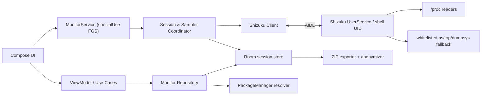
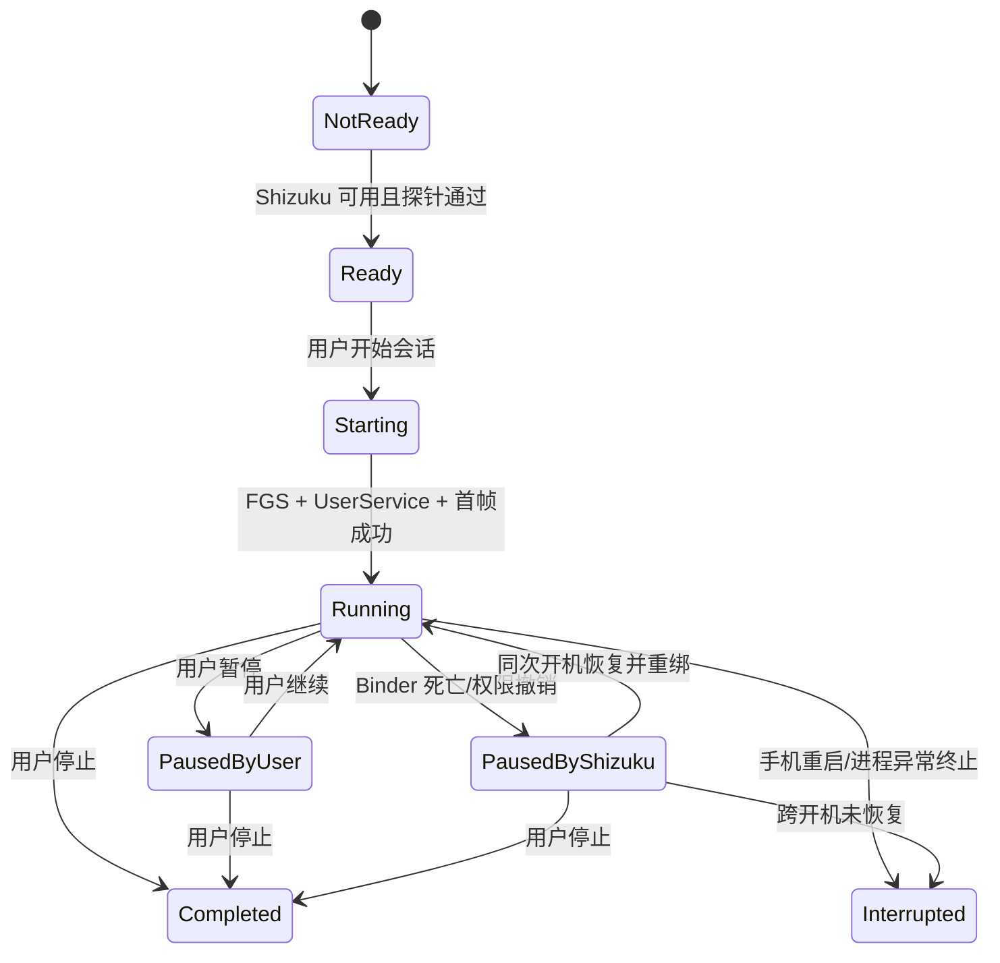

# ProcView 产品与技术规格

> 状态：已确认，可进入开发  
> 版本：1.0  
> 日期：2026-08-11  
> 产品名：ProcView  
> Application ID / Namespace：`io.github.PctAIGM.procview`

## 1. 文档目的

本文定义 ProcView 首个可用版本的产品范围、技术架构、数据口径、交互、权限、兼容策略、验收标准和实施顺序。它是开发依据，不包含实际 Android 项目或实现代码。

ProcView 是一款依赖 Shizuku 的只读 Android 任务管理器。它面向个人侧载使用，核心价值是：

1. 实时显示系统中尽可能完整的应用与进程 CPU、内存占用。
2. 通过用户主动创建的监控会话，回看发热、卡顿、异常耗电发生时的资源占用。
3. 当 ROM 限制访问时明确说明数据覆盖范围，不制造“已看到全部进程”的假象。

## 2. 已确认的产品决策

| 项目 | 决策 |
|---|---|
| 交付范围 | 输出完整方案；本阶段不创建 Android 项目 |
| 分发 | 个人侧载 APK |
| 核心能力 | 实时监控 + 历史诊断 |
| 特权后端 | 首版 Shizuku；架构预留 Root 后端 |
| 安全边界 | 完全只读，不结束、强停、冻结或修改其他应用 |
| 数据边界 | 默认仅本机；允许用户主动导出和匿名化 |
| 系统范围 | Android 11+（API 30+） |
| 首要验证机 | 小米 17 Pro Max，Android 16 |
| 监控生命周期 | 用户手动启动前台监控会话，允许锁屏持续采样 |
| 列表组织 | 应用聚合，可展开子进程；系统/原生进程独立显示 |
| 历史范围 | 整机指标、每帧 Top 20、用户关注应用 |
| CPU 口径 | 整机归一化为 0–100% |
| 内存口径 | 高频 RSS，低频 PSS |
| 默认采样 | 前台 1 秒、后台/锁屏 5 秒、PSS 15 秒 |
| 诊断上下文 | 整机内存、温度、电量、充电状态、屏幕状态 |
| 异常提醒 | 首版不做阈值或智能提醒 |
| 留存 | 保留到用户手动删除；容量接近阈值时提醒 |
| 导出 | ZIP：JSON 元数据 + CSV 指标；可匿名化 |
| 主导航 | 实时、记录、设置 |
| UI 技术 | Kotlin + Jetpack Compose + Material 3 |
| 主题 | 动态主题与固定监控主题可切换；支持浅色/深色 |
| 语言 | 简体中文 + 英文 |
| Shizuku 断连 | 暂停并标记缺口；同次开机恢复后续接；重启后标记中断 |
| 包可见性 | 声明 `QUERY_ALL_PACKAGES`，用于 UID/包名/应用图标映射 |
| 验收优先级 | 准确性 → 稳定性 → 功耗 → 视觉润色 |

## 3. 范围

### 3.1 首版必须具备

- Shizuku 安装、运行、授权状态引导。
- 运行时能力探测与兼容性报告。
- 用户命名的监控会话：开始、暂停、继续、停止、备注。
- 实时整机 CPU/内存趋势图。
- 全量可见进程的实时列表、搜索、过滤、排序。
- 应用级聚合、子进程展开和系统进程分类。
- 应用/进程关注功能。
- 应用与进程技术详情。
- 历史会话列表及同步时间轴回放。
- 电池、充电、屏幕、热状态等上下文事件。
- 本地持久化、存储用量管理、手动删除。
- ZIP 导出、匿名化导出。
- 中英文、浅色/深色、动态/固定监控配色。
- Shizuku 断连、ROM 部分可见、进程瞬时消失等容错。

### 3.2 首版明确不做

- `kill`、`am force-stop`、冻结、卸载、禁用应用。
- 权限修改、AppOps 修改、Secure Settings 修改。
- 任意 Shell 命令输入或终端界面。
- Root/Sui 的实际实现。
- 开机自动监控、全天静默监控。
- CPU/内存异常通知或自动异常检测。
- 云同步、账号、遥测、广告、崩溃数据上传。
- 单应用网络流量、磁盘 I/O、帧率和 GPU 监控。
- Google Play 首发适配与审核材料。

## 4. 平台与构建基线

- `minSdk = 30`（Android 11）。
- `compileSdk = 36`、`targetSdk = 36`（Android 16）。
- Kotlin、Gradle、Android Gradle Plugin 和 Compose BOM 使用实施时的稳定版本，不使用预览版。
- UI：Jetpack Compose + Material 3 + Navigation Compose。
- 并发：Kotlin Coroutines + Flow。
- 数据库：Room，启用 WAL。
- 设置：DataStore。
- 序列化：`kotlinx.serialization`。
- 后台执行：用户主动启动的 `specialUse` Foreground Service。
- 特权执行：Shizuku `UserService` + AIDL；不使用已弃用的 `Shizuku.newProcess()`。
- Application ID 与代码 namespace 均保持为 `io.github.PctAIGM.procview`。

建议首版保持单一 `:app` Gradle 模块，通过包结构隔离层次；功能稳定后再按编译成本拆分模块。建议包结构：

```text
io.github.PctAIGM.procview
├─ ui                 Compose 页面、组件、主题与导航
├─ monitor            前台服务、会话协调、采样调度
├─ shizuku            Binder 生命周期、AIDL 客户端、能力探测
├─ sampler            数据源接口、帧组装、聚合算法
├─ data               Room、Repository、DataStore
├─ export             ZIP/CSV/JSON 与匿名化
├─ model              领域模型与状态机
└─ diagnostics        兼容性报告、日志与自检
```

## 5. 权限与清单

### 5.1 计划声明

```xml
<uses-permission android:name="android.permission.QUERY_ALL_PACKAGES" />
<uses-permission android:name="android.permission.FOREGROUND_SERVICE" />
<uses-permission android:name="android.permission.FOREGROUND_SERVICE_SPECIAL_USE" />
<uses-permission android:name="android.permission.POST_NOTIFICATIONS" />
<uses-permission android:name="android.permission.WAKE_LOCK" />
```

监控服务声明：

```xml
<service
    android:name=".monitor.MonitorService"
    android:exported="false"
    android:foregroundServiceType="specialUse">
    <property
        android:name="android.app.PROPERTY_SPECIAL_USE_FGS_SUBTYPE"
        android:value="User-initiated local CPU and memory diagnostic session" />
</service>
```

同时按 Shizuku 官方 API 接入 `ShizukuProvider`、权限请求和 UserService。最终清单以所采用 Shizuku API 稳定版的官方示例为准。

### 5.2 明确不声明

- 不声明 `INTERNET`，从平台层面降低意外上传风险。
- 不声明存储读写权限；导出使用 Storage Access Framework。
- 不声明 `RECEIVE_BOOT_COMPLETED`；手机重启后不自动恢复监控。
- 不声明 Usage Stats、无障碍、悬浮窗、设备管理员等无关权限。
- 不尝试声明普通应用无法获得的 `DUMP` 等签名权限。

### 5.3 唤醒锁策略

前台服务本身不会保证锁屏后 CPU 持续运行。为兑现“锁屏仍按 5 秒节奏采样”，默认均衡模式采用 `PARTIAL_WAKE_LOCK`：

- 仅在用户主动启动的会话处于运行状态且屏幕关闭时持有。
- 屏幕点亮、会话暂停、Shizuku 断连、会话停止时立即释放。
- 使用固定、无隐私信息的 tag，例如 `io.github.PctAIGM.procview:monitor`。
- 使用带超时的获取方式并周期续期，避免异常路径永久持有。
- 通知和设置页明确提示锁屏精确采样会增加耗电。
- 省电预设不持有唤醒锁，允许深度休眠期间出现采样缺口。

## 6. 总体架构



### 6.1 普通应用进程职责

- 渲染界面、维护导航和用户设置。
- 启动/停止前台监控服务。
- 管理会话状态、历史写入和通知。
- 使用 `PackageManager` 将 UID/包名解析为应用名称与图标。
- 聚合进程为应用、排序、筛选和生成历史排名。
- 导出与匿名化。

### 6.2 Shizuku UserService 职责

- 以 Shizuku ADB 模式提供的 shell UID 运行。
- 直接枚举和读取允许访问的 `/proc` 节点。
- 执行固定白名单的只读回退命令。
- 计算或返回采样所需的原始数字，不返回无界文本。
- 不持久化业务数据，不使用 UserService 中不可靠的 Android Context API。

UserService 使用稳定 `tag`、独立进程后缀和版本号，`daemon(false)`。前台服务保持绑定；解绑或 Shizuku 服务死亡后 UserService 结束。

### 6.3 后端抽象

定义统一接口，首版实现 `ShizukuProcBackend`，未来可增加 `RootProcBackend`：

```kotlin
interface PrivilegedMonitorBackend {
    suspend fun probe(): CapabilityReport
    fun frames(config: SamplingConfig): Flow<RawMetricFrame>
    suspend fun readPss(keys: List<ProcessKey>): Map<ProcessKey, Long>
    suspend fun diagnostics(): DiagnosticBundle
}
```

Root 后端不进入首版构建路径，也不在 UI 中显示不可用入口。

## 7. Shizuku 生命周期与能力探测

### 7.1 状态

```text
未安装 → 未运行 → 未授权 → 正在连接 → 可用
                                  ↓
                           部分可用 / 不兼容
```

每次 App 启动必须重新检查：

1. Shizuku Binder 是否存在。
2. Shizuku API 版本是否满足要求。
3. 当前应用授权是否仍有效。
4. UserService 是否能绑定。
5. `/proc` 与回退命令的实际可读范围。

非 Root Shizuku 在手机重启后通常需要用户重新启动服务；授权通常仍保留，但不能假定 Binder 持续存在。

### 7.2 能力探针

探针只执行只读操作，至少记录：

- Shizuku 模式和运行 UID。
- 是否能读取 `/proc/stat`、`/proc/meminfo`。
- `/proc` 中枚举到的数字 PID 数。
- `ps -A` 枚举数。
- 可成功读取 `stat`、`status`、`cmdline` 的进程数。
- 是否能读取 PID 1 的基础统计。
- `dumpsys meminfo`/checkin 模式是否可用。
- 可获得的温度/thermal 数据源。
- 包名与 UID 映射是否正常。

界面中的“覆盖率”定义为：

```text
指标覆盖率 = 成功得到 CPU 与 RSS 的进程数 / 本次已枚举进程数
```

该比例不能证明 ROM 没有隐藏其他进程，因此 UI 必须写成“已枚举进程中的指标覆盖率”，不能声称“系统全部进程覆盖率 100%”。同时显示 `已枚举 N / CPU 可读 N / RSS 可读 N / PSS 可读 N`。

### 7.3 小米/HyperOS 注意项

- 首次测试确认 Shizuku 已在无线调试模式正常运行。
- 在兼容性页提示用户允许 Shizuku 和 ProcView 后台运行。
- 不通过品牌硬编码判断能力；所有结论来自运行时探针。
- 若系统杀死 Binder 或前台服务，记录明确事件，不静默伪造连续时间轴。

## 8. 采样数据与算法

### 8.1 进程身份

进程唯一键不能只使用 PID，必须使用：

```text
ProcessKey = (pid, startTimeTicks)
```

`startTimeTicks` 来自 `/proc/<pid>/stat`，用于防止 PID 复用导致历史串线。解析 `stat` 时从最后一个 `)` 后开始拆字段，以兼容进程名包含空格或括号。

### 8.2 CPU

每个采样周期读取：

- `/proc/stat` 首行：整机各 CPU 时间累计值。
- `/proc/<pid>/stat`：`utime + stime`。

公式：

```text
totalDelta = 本次整机累计时间 - 上次整机累计时间
processDelta = 本次(utime + stime) - 上次(utime + stime)
processCpuPercent = 100 × processDelta / totalDelta
```

规则：

- 结果按整机容量归一化到 0–100%，八核不会显示 800%。
- 应用 CPU 为其当前所有子进程 CPU 之和。
- 首帧没有 delta，CPU 显示 `—`，不显示错误的 0%。
- 不把已退出子进程累计时间计入当前父进程。
- 使用单调时钟记录帧时间，墙上时间仅用于展示。
- 对负 delta、计数回退、读取中进程退出做丢弃处理。

### 8.3 RSS

- 高频读取 `/proc/<pid>/status` 的 `VmRSS`；必要时回退到 `statm × pageSize`。
- RSS 包含共享页的重复计数，应用多进程 RSS 求和只能标为“RSS 合计”。
- 绝不把所有进程 RSS 相加当成整机已用内存。

### 8.4 PSS

- PSS 通过 ROM 能力探测后选择 `dumpsys meminfo` 的机器可读模式。
- 默认每 15 秒仅采集：当时 Top 20、关注应用、当前打开详情的进程。
- PSS 为可空值，并显示“最后更新时间”。
- PSS 采集超时或失败不阻塞下一帧 CPU/RSS。
- 应用级 PSS 可对其子进程求和，作为更接近实际内存重量的指标。

### 8.5 整机内存

- 来源：`/proc/meminfo`。
- 优先使用 `MemAvailable`。
- 展示：总量、可用、使用率；不使用进程 RSS 反推总量。
- Android 的缓存和 zRAM 会影响直觉，详情中提供口径说明。

### 8.6 进程元数据

尽可能获得：

- PID、PPID、UID。
- 进程名、包名、命令行。
- Linux 进程状态。
- 启动时间。
- 应用名称、图标、系统/用户应用分类。

UID 可能映射到多个包；此时保留全部候选并通过进程名前缀选择主要包，无法唯一判断时显示“共享 UID”。系统/native 进程无法映射应用时按原生命令名展示。

### 8.7 温度、电池与屏幕

- 电量、充电状态、电池温度：系统电池状态 API/广播。
- 热状态：`PowerManager` thermal status 及变化监听。
- 屏幕状态：`PowerManager.isInteractive` 并记录变化事件。
- 可选温度区：UserService 探测可读 thermal zone 后展示，必须标注传感器名和数据源。
- 若设备只提供电池温度，不得把它标成“CPU 温度”。

## 9. 采样调度

默认“均衡”预设：

| 场景 | CPU/RSS | PSS | 通知刷新 | 唤醒锁 |
|---|---:|---:|---:|---|
| 实时页可见且屏幕亮 | 1 秒 | 15 秒 | 5 秒 | 不持有 |
| App 后台且屏幕亮 | 5 秒 | 15 秒 | 5 秒 | 不持有 |
| 屏幕关闭、会话运行 | 5 秒 | 15 秒 | 5 秒 | 持有 partial wake lock |
| 会话暂停或 Shizuku 断连 | 停止 | 停止 | 状态变化时 | 释放 |

设置页提供三个预设：

| 预设 | 前台 | 后台/锁屏 | PSS | 锁屏策略 |
|---|---:|---:|---:|---|
| 精细 | 1 秒 | 2 秒 | 10 秒 | 持有唤醒锁 |
| 均衡（默认） | 1 秒 | 5 秒 | 15 秒 | 持有唤醒锁 |
| 省电 | 2 秒 | 15 秒 | 60 秒 | 不持有，允许休眠缺口 |

不开放小于 1 秒的自定义周期，避免 ProcView 自身变成显著负载源。

采样循环采用固定目标时刻而非简单 `delay(interval)` 累加，记录实际帧间隔和漂移。若单次采集超过周期，跳过过期 tick，不连续补采造成突发负载。

## 10. IPC 设计

为降低 Binder 负担，进程身份和数值帧分离：

- `ProcessCatalogDelta`：仅在进程集合或元数据变化时传输字符串。
- `MetricFrame`：每帧只传 ProcessKey、CPU、RSS、状态和可选 PSS。
- 每个回调包含帧序号、单调时间、数据源状态与丢帧标志。
- 设置最大进程数和单帧字节保护；超过时分片传输，不依赖巨型 Bundle。
- AIDL 参数使用明确类型，不传任意命令文本。
- UserService 命令执行器只接受内部枚举和经过校验的 PID 列表。

## 11. 会话状态机



### 11.1 同次开机恢复

- 保存 `/proc/sys/kernel/random/boot_id`。
- Binder 死亡后会话进入 `PAUSED_SHIZUKU`，立即停止采样并释放唤醒锁。
- Shizuku Binder 再次出现且 boot ID 不变时，自动重绑并继续同一会话。
- 历史时间轴插入明确的 `DATA_GAP_START` 与 `DATA_GAP_END`。

### 11.2 重启和异常终止

- 数据库中会话保持心跳和最后成功帧时间。
- 下次 App 启动若发现未关闭会话且 boot ID 已变化，将其标记 `INTERRUPTED`。
- 不从 `BOOT_COMPLETED` 自动启动 Shizuku、前台服务或监控。
- 允许用户复制中断会话名称和设置，手动开始新会话。

## 12. 本地数据模型

### 12.1 Room 表

#### `sessions`

- `id`：UUID。
- `name`、`note`。
- `status`：RUNNING/PAUSED/COMPLETED/INTERRUPTED。
- `startWallTime`、`endWallTime`。
- `startElapsedRealtime`。
- `bootId`。
- `samplingProfile`。
- `deviceModel`、`androidVersion`、`romDisplay`。
- `procViewVersion`、`shizukuVersion`、`backendMode`。
- `capabilityReportId`。
- `lastHeartbeat`。

#### `system_samples`

- `sessionId`、`sequence`、`elapsedOffsetMs`。
- `cpuPercentBasisPoints`。
- `memTotalKb`、`memAvailableKb`。
- `batteryLevel`、`batteryTempDeciC`、`chargingState`。
- `thermalStatus`、可选温度值与传感器名。
- `screenInteractive`。
- `samplingIntervalMs`、`collectionDurationMs`、`frameFlags`。

#### `process_identities`

- `id`、`sessionId`。
- `pid`、`startTimeTicks`、`ppid`、`uid`。
- `packageName`、`processName`、`displayName`。
- `commandLine`。
- `isSystem`、`isNative`、`firstSeen`、`lastSeen`。

#### `process_samples`

- `sessionId`、`systemSampleSequence`、`processIdentityId`。
- `cpuPercentBasisPoints`。
- `rssKb`、可空 `pssKb`。
- `processState`、`rank`。
- `reasonKept`：TOP20/PINNED/DETAIL。

#### `session_events`

- `sessionId`、`elapsedOffsetMs`、`type`、`payloadJson`。
- 类型包括：屏幕变化、充电变化、thermal 变化、Shizuku 缺口、用户备注、采样降级。

#### `pinned_apps`

- `packageName`、`createdAt`、可选别名。

#### `capability_reports`

- 探针时间、原始计数、各能力布尔值、错误分类、可导出的诊断摘要。

### 12.2 写入策略

- 实时 UI 内存中保留最近 60 秒全量可见进程帧。
- 历史仅写入整机帧、Top 20、关注应用和正在查看详情的进程。
- 单个事务批量写入最多 5 秒数据；异常时最大预期丢失不超过一个批次。
- WAL 数据库，后台线程串行写入；不得在 Binder 或主线程直接写数据库。
- 结束会话后执行轻量 checkpoint 和统计汇总，不在监控运行中做重型压缩。

### 12.3 留存和容量

- 不自动删除完成会话。
- 设置页显示总占用和每个会话占用。
- 默认在 ProcView 数据达到 500 MB 或设备可用空间低于 10% 时提醒，以先发生者为准。
- 用户可修改容量提醒阈值，但不能关闭“磁盘空间严重不足”提示。
- 删除会话必须二次确认；删除后不可恢复，导出按钮与删除按钮并列提供。

## 13. 导出与匿名化

文件名：

```text
procview-session-YYYYMMDD-HHmmss-<safe-name>.zip
```

内容：

```text
manifest.json          会话、设备、版本、口径、采样配置
system.csv             整机 CPU/内存/电池/温度/屏幕时间线
processes.csv          Top 20 与关注进程时间线
events.csv             断连、屏幕、充电、thermal、备注事件
capabilities.json      本次设备能力和覆盖率报告
README.txt             字段、单位和隐私说明
```

导出通过 Storage Access Framework 选择目标位置，不申请广泛存储权限。

### 13.1 匿名模式

- 每次导出生成随机盐，在该导出内将包名稳定映射为 `app_001` 等代号。
- 应用名、包名、进程名和命令行参数替换或删除。
- PID 可保留用于同一会话内关联；UID 默认重编号。
- 墙上时间默认改为相对会话时间。
- 会话名称、备注、设备详细版本默认排除，导出前允许逐项选择。
- 不导出设备序列号、Android ID、账号、电话号码等标识符；系统也不采集这些字段。
- 导出前展示“将包含的数据”预览。

## 14. 信息架构与界面

UI 采用 Material 3。手机使用三个主入口；横屏、平板或折叠屏使用自适应 Navigation Rail 和双栏详情。交互目标不低于 48 dp，所有图表同时提供数值和无障碍描述。

### 14.1 首次引导/不可用状态

按状态展示单一下一步操作：

1. 未安装 Shizuku：说明依赖并链接官方渠道。
2. Shizuku 未运行：展示 Android 11+ 无线调试启动说明。
3. 未授权：解释只读数据范围，再触发 Shizuku 授权。
4. 正在探测：展示可取消进度。
5. 部分可用：列出限制，允许用户仍然进入实时页。
6. 可用：展示最近一次探针时间和“重新检测”。

### 14.2 实时页

顶部区域：

- Shizuku 状态 chip。
- 已枚举进程数和指标覆盖率。
- 当前会话名称、时长。
- 开始/暂停/继续/停止主操作。
- 最近 60 秒整机 CPU 与内存两张紧凑趋势图。

进程区域：

- 默认按 CPU 降序。
- 点击列头切换 CPU、RSS、PSS、名称；记住用户上次选择。
- 搜索应用名、包名、进程名、PID。
- 过滤 chip：全部、用户应用、系统/原生、已关注。
- 应用行显示图标、名称、CPU、RSS 合计、最近 PSS、子进程数。
- 展开后显示各 PID；瞬时退出进程以短暂淡出状态保留一个 UI tick。
- PSS 显示更新时间；过旧值采用弱化颜色，不冒充实时值。
- ProcView 自身进程正常显示并标注“采集器”，不隐藏自身开销。

### 14.3 应用/进程详情

- 应用聚合与各子进程趋势。
- CPU、RSS、PSS 当前值和会话峰值。
- PID、UID、PPID、Linux 状态、启动时间。
- 包名、进程名、命令行。
- 数据源和最后采样时间。
- 关注/取消关注。
- 不出现结束、强停或优化按钮。

### 14.4 记录页

会话列表展示：

- 名称、状态、起止时间、时长、文件大小。
- CPU 峰值、内存最低可用量、最高温度/thermal 状态。
- 主要 Top 进程摘要。

会话详情：

- 同步时间轴，拖动游标时同时更新整机曲线、温度/电池、屏幕状态和当时 Top 进程。
- 明确绘制 Shizuku 断连、休眠缺口和采样降级区域。
- 可选择关注应用叠加趋势，限制同时显示的折线数量。
- 支持编辑会话名称和备注、导出、匿名导出、删除。

### 14.5 设置页

- 采样预设：精细、均衡、省电。
- 主题：跟随系统/浅色/深色；动态色/固定监控色。
- 语言：跟随系统、简体中文、English。
- 通知和锁屏采样说明。
- 关注应用管理。
- 存储用量、容量提醒阈值和会话清理。
- 导出默认选项和匿名化默认值。
- 兼容性诊断与探针报告。
- 权限、隐私、开源依赖、版本信息。

### 14.6 配色

- Material 容器和控件可使用系统动态色。
- 图表语义色固定：CPU、内存、温度、电池分别使用稳定且色盲友好的颜色。
- 高占用不能只依赖红色表达，同时显示数字、图标或标签。
- 深色模式避免纯黑大面积背景和过饱和曲线。

## 15. 前台服务通知

通知必须持续可见并准确描述行为：

- 标题：`ProcView 正在监控 · <会话名>`。
- 内容：持续时间、整机 CPU、内存使用率、当前采样周期。
- 状态：运行、已暂停、等待 Shizuku。
- 操作：暂停/继续、停止。
- 指标最多每 5 秒更新，避免每帧重建通知。
- 停止操作立即停止采样、刷新数据库、释放唤醒锁、解绑 UserService。
- Android 13+ 请求通知权限；即使用户拒绝，也要在应用内清楚说明系统对 FGS 通知的展示行为。
- 只允许从可见 Activity 中由用户操作启动会话，不从后台偷偷启动。

## 16. 安全与隐私

- UserService 中只有固定的只读探针和采样路径，不提供任意 Shell 接口。
- PID 参数必须校验为正整数，并绑定到当前已知 ProcessKey。
- 所有自有 Activity、Service、Receiver 默认 `exported=false`；Shizuku 必需组件按官方要求最小化暴露。
- Binder 输入限制数量、字符串长度和调用频率。
- 不记录 Shell 输出中的无关内容。
- 命令行可能包含敏感参数：仅本机显示和存储，匿名导出时默认删除。
- Room 数据依赖 Android 应用沙箱与文件级加密；首版不引入自定义数据库密码。
- 不申请网络权限、不集成统计或广告 SDK。
- `QUERY_ALL_PACKAGES` 仅用于把 UID/进程映射为本机应用名称和图标。
- 若未来公开分发，必须重新评估 Google Play 包可见性、前台服务和提升权限政策，不能直接沿用个人侧载假设。

## 17. 错误与降级策略

| 情况 | 行为 |
|---|---|
| Shizuku 未运行 | 禁止新建会话，保留历史浏览和导出 |
| 授权被撤销 | 当前会话暂停、释放唤醒锁、通知提示重新授权 |
| UserService Binder 死亡 | 插入数据缺口，指数退避重绑，但不伪造帧 |
| `/proc` 部分不可读 | 展示可读数据和指标覆盖率，能力页列出失败类型 |
| `/proc` 主路径失败 | 使用白名单 `ps/top` 快照作为兼容回退并标注数据源 |
| 单个进程采样中退出 | 忽略该进程本帧，不将其当成全局错误 |
| PSS 超时 | 保留旧 PSS 并显示年龄，CPU/RSS 继续 |
| 数据库写入失败 | 暂停会话并显著通知；不继续制造未持久化的假象 |
| 存储空间不足 | 停止持久化并提示导出/删除，不自动删历史 |
| FGS 被 ROM 杀死 | 下次启动将未结束会话标为中断 |
| 通知操作重复触发 | 状态机保证幂等 |

## 18. 性能预算与验收标准

以下指标首先在小米 17 Pro Max / Android 16 上验收，再扩展到其他 ROM。

### 18.1 数据正确性

- CPU：对稳定人工负载连续采样 60 秒，与同时间窗 `/proc` 基准算法比较；占用高于 5% 时，进程 CPU 误差目标为 ±3 个百分点或 ±10% 相对误差，取更宽者。
- CPU 归一化：所有展示值均为整机 0–100%，应用聚合等于其有效子进程之和。
- RSS：与同一时刻 `/proc/<pid>/status` 的 `VmRSS` 一致，允许页面大小/采样时间造成的微小差异。
- PSS：与同一时段 `dumpsys meminfo` 对比，目标误差不超过 5%；UI 必须显示采样年龄。
- PID 复用测试中不得把新进程数据追加到旧进程历史。
- 整机内存不得通过累加 RSS 计算。

### 18.2 覆盖率与降级

- 首要验证机上，CPU+RSS 可读数达到 `ps -A` 已枚举进程数的 95% 以上；达不到时仍可发布内部测试版，但必须在报告中说明根因。
- 无法知道的隐藏进程不计入虚假的“100% 全系统覆盖”。
- 主路径失败后回退模式可进入实时页，且每个页面都能识别当前数据源。

### 18.3 时序与稳定性

- 前台 1 秒模式的采样间隔 p95 在 0.8–1.2 秒之间。
- 锁屏均衡模式的采样间隔 p95 在 4–6 秒之间。
- 排除明确记录的 Shizuku/系统中断后，不连续丢失两帧以上。
- 连续 8 小时会话无崩溃、ANR、Binder 泄漏或数据库损坏。
- 异常终止后最多丢失一个写入批次（目标不超过 5 秒）。
- 旋转屏幕、切换深色模式和切换语言不会停止会话或重复启动采样器。

### 18.4 自身开销

- 前台 1 秒、500 个以内可见进程时，ProcView 整体 CPU 平均目标不超过整机 2%。
- 锁屏 5 秒模式下采集 CPU 平均目标不超过整机 0.5%，唤醒锁造成的额外耗电单独报告。
- App 普通进程与 UserService 合计 RSS 目标不超过 150 MB。
- 全量列表滚动期间保持响应；采样帧不得在主线程解析 `/proc`、调用 Binder 或写 Room。
- 在首要验证机进行 2 小时锁屏 A/B 测试，报告相对空闲基线的额外耗电；若超过 6 个百分点，默认预设需降低频率或重新评估持续唤醒锁。

### 18.5 UI 与可访问性

- 进程列表在每秒刷新时不跳回顶部，不丢失展开状态。
- 排序相同值使用稳定次级键，避免行持续抖动。
- 所有交互目标至少 48 dp。
- 图表具备文本摘要，TalkBack 可读出当前值与趋势。
- 中英文无截断，支持系统字体放大到 200% 的主要流程。

### 18.6 隐私与安全

- APK 清单中不存在 `INTERNET`。
- 代码中不存在写操作命令和任意 Shell 入口。
- 匿名导出中不出现原始包名、应用名、命令行、会话备注和绝对时间（除非用户在预览中显式选择）。
- 停止或暂停后唤醒锁在 1 秒内释放。

## 19. 测试计划

### 19.1 单元测试

- `/proc/stat` 与 `/proc/<pid>/stat` 解析。
- 包含空格、嵌套括号、Unicode 的进程名。
- PID 复用、进程瞬时退出、字段缺失、权限拒绝。
- CPU delta、溢出/回退值、首帧行为和整机归一化。
- RSS/PSS 单位转换、应用聚合和旧 PSS 年龄。
- Top 20 与关注应用历史保留规则。
- 会话状态机的所有合法/非法转换。
- 匿名化稳定映射与敏感字段移除。
- CSV 引号、换行、UTF-8 和大数据导出。

### 19.2 集成/仪器测试

- 使用 Fake Backend 模拟 Shizuku 未安装、未运行、拒绝、断连和部分可读。
- FGS 启动、5 秒内 `startForeground`、通知操作幂等。
- 唤醒锁在屏幕/暂停/断连/停止各路径正确获取与释放。
- Room 事务、异常恢复、数据库迁移和存储不足。
- Compose 导航、配置变化、进程列表稳定键和排序记忆。
- 导出 ZIP 结构与再次解析验证。

### 19.3 真机矩阵

最低矩阵：

1. 小米 17 Pro Max / Android 16 / Shizuku 无线调试（发布门槛）。
2. AOSP/Pixel Android 16。
3. Android 14 主流设备。
4. Android 11 设备，验证最低版本和无线调试路径。
5. 至少一台表现为部分 `/proc` 可读的厂商 ROM，验证降级 UX。

场景包括：锁屏、Doze、充电、低电量、内存压力、应用大量启停、Shizuku 手动停止、授权撤销、通知权限拒绝、系统语言/主题变化、磁盘空间不足和手机重启。

## 20. 实施里程碑

工期仅用于排序，按单人开发粗估；真实工期以第 0 阶段结果为准。

### M0：可行性尖峰（1–2 天）

- 建立最小 Shizuku UserService。
- 在小米 Android 16 上验证 `/proc/stat`、PID stat/status/cmdline、`ps -A`、PSS 和 thermal 数据源。
- 测量 1 秒全进程读取成本。
- 验证 `specialUse` FGS、锁屏采样和唤醒锁。

退出条件：形成真实能力报告；确认主路径或选定回退路径。

### M1：采样核心（3–5 天）

- 实现 ProcessKey、procfs 解析器、CPU/RSS 算法。
- 实现 PSS 低频调度、包名映射和应用聚合。
- 实现能力探针和 Fake Backend。
- 完成核心单元测试。

退出条件：命令行/测试界面可稳定输出准确 typed frames。

### M2：Shizuku 与运行生命周期（3–4 天）

- 完成 AIDL、UserService 绑定、Binder death/rebind。
- 实现会话状态机和 `specialUse` MonitorService。
- 完成通知、唤醒锁、前后台采样切换。

退出条件：锁屏 2 小时采样连续，断连缺口正确记录。

### M3：实时 UI（3–5 天）

- 实时图表、进程树、搜索、过滤、排序和关注。
- 应用/进程详情。
- Shizuku 引导和兼容性页面。
- 中英文、主题和自适应布局基础。

退出条件：主设备上能作为日常实时任务管理器使用。

### M4：历史与存储（4–6 天）

- Room schema、批量写入、会话管理。
- 记录页、同步时间轴和事件标记。
- 容量统计、删除和异常恢复。

退出条件：8 小时会话稳定，重启后正确标记中断。

### M5：导出、隐私与完善（3–4 天）

- ZIP/CSV/JSON、匿名化和预览。
- 设置页、存储提醒、诊断包。
- 无障碍、语言和主题完善。

退出条件：导出可由 Excel/脚本解析，匿名化检查通过。

### M6：兼容与发布验收（3–5 天）

- 真机矩阵、性能、耗电和长稳测试。
- 修复 OEM 差异，完善回退解析器。
- 生成签名侧载 APK、隐私说明和使用文档。

退出条件：第 18 节所有阻断级验收项通过。

预计总量：约 4–6 周单人开发。最可能改变工期的因素是小米 ROM 的 `/proc` 可见性和 PSS 回退成本。

## 21. 风险登记

| 风险 | 概率 | 影响 | 缓解 |
|---|---|---|---|
| OEM 限制 shell 跨 UID 读取 `/proc` | 中 | 高 | M0 真机探针；能力报告；`ps/top` 回退；未来 Root 后端 |
| Shizuku 在重启或省电策略下停止 | 高 | 中 | 明确状态、Binder death、同开机重绑、时间轴缺口、后台设置指引 |
| 全进程 1 秒读取自身开销过高 | 中 | 高 | 直接 procfs、身份缓存、分离 catalog/frame、自适应周期、性能门槛 |
| 全量 PSS 过慢 | 高 | 高 | 仅 Top 20/关注/详情；15 秒低频；超时隔离 |
| 锁屏唤醒锁耗电明显 | 高 | 中 | 仅会话期间持有；省电预设；通知披露；A/B 耗电门槛 |
| PID 复用污染历史 | 中 | 高 | `(pid,startTimeTicks)` 唯一键和专项测试 |
| 实时排序导致列表抖动 | 高 | 中 | 稳定键、次级排序、刷新节流、保留滚动与展开状态 |
| 命令行/包名导出泄露隐私 | 中 | 高 | 本地优先、无网络权限、匿名化默认删除、导出预览 |
| Room 长会话体积增长 | 中 | 中 | 仅持久化 Top 20/关注；批量写；容量页面和阈值提醒 |
| 未来 Play 审核拒绝 | 中 | 高 | 首版只侧载；保持只读；无任意 shell；公开分发前重新做政策评估 |

## 22. 发布定义（Definition of Done）

首版只有在以下条件同时满足时才算完成：

- 小米 17 Pro Max / Android 16 上能通过 Shizuku 开始、暂停、继续和停止会话。
- 实时页显示整机趋势、应用聚合、子进程和系统进程。
- CPU、RSS、PSS 通过正确性基准。
- 锁屏均衡模式按目标节奏工作，并已量化耗电。
- Shizuku 断连后时间轴出现缺口，同次开机恢复后可续接。
- 重启后旧会话标为中断，且不会自动开启监控。
- 8 小时稳定性、PID 复用、进程 churn 和存储异常测试通过。
- 历史时间轴可定位任意时刻的系统状态和 Top 进程。
- ZIP 正常导出，匿名包不包含已定义的敏感字段。
- 中英文、浅/深色和主要无障碍流程可用。
- APK 无网络权限、无写命令、无任意 Shell 入口。
- 已提供权限说明、锁屏耗电说明、兼容性说明和本地隐私说明。

## 23. 开发前第一张验证清单

在正式搭建完整 UI 前，先在目标小米设备记录以下事实：

- [ ] Shizuku 模式、API 版本和实际 UID。
- [ ] `/proc` 数字 PID 数与 `ps -A` 数量。
- [ ] 跨 UID `stat/status/cmdline` 成功率。
- [ ] PID 1 是否可读。
- [ ] 500 个进程规模下单帧 CPU/RSS 耗时。
- [ ] PSS 单 PID、Top 20 批次耗时和可用命令格式。
- [ ] 电池温度、thermal status、thermal zone 可用性。
- [ ] `specialUse` FGS 在 Android 16 上的启动与通知表现。
- [ ] 屏幕关闭后无唤醒锁/有唤醒锁的采样间隔差异。
- [ ] 2 小时均衡模式相对空闲基线的额外耗电。
- [ ] Shizuku 手动停止与重新启动后的恢复路径。
- [ ] HyperOS 后台限制下前台服务是否被杀。

只有这张清单完成后，才能冻结数据源实现和最终性能预算。

## 24. 参考资料

- [Shizuku API 与 UserService](https://github.com/RikkaApps/Shizuku-API/blob/master/README.md#userservice)
- [Shizuku 启动与厂商 ROM 指引](https://shizuku.rikka.app/zh-hans/guide/setup/)
- [AOSP adbd 与 AID_READPROC](https://android.googlesource.com/platform/system/core/+/refs/heads/android11-platform-release/adb/daemon/main.cpp)
- [Android dumpsys、procstats 与 meminfo](https://developer.android.com/tools/dumpsys)
- [ActivityManager 跨 UID 内存信息限制](https://developer.android.com/reference/android/app/ActivityManager#getProcessMemoryInfo(int%5B%5D))
- [Android 前台服务类型：specialUse](https://developer.android.com/develop/background-work/services/fgs/service-types)
- [Android 前台服务时限](https://developer.android.com/develop/background-work/services/fgs/timeout)
- [Android 前台服务后台启动限制](https://developer.android.com/develop/background-work/services/fgs/restrictions-bg-start)
- [Android 唤醒锁选择指南](https://developer.android.com/develop/background-work/background-tasks/awake)
- [Android 唤醒锁最佳实践](https://developer.android.com/develop/background-work/background-tasks/awake/wakelock/best-practices)
- [Android Application ID 与 namespace](https://developer.android.com/build/configure-app-module)
- [Android 包可见性](https://developer.android.com/training/package-visibility/declaring)
- [Material 3](https://m3.material.io/)

---

本规格冻结了首版范围。进入开发后，如需增加进程控制、Root、网络/I/O、自动监控或公开商店分发，应另开设计变更，不应悄悄混入首版。
